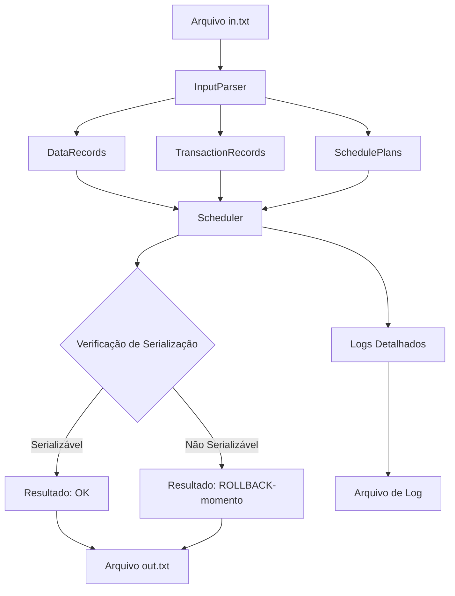

# Za-Warudo - Escalonador Baseado em Timestamp

## Introdução

Za-Warudo é um sistema desenvolvido em C# (.NET 9.0) que implementa um **Escalonador Baseado em Timestamp** para
verificar a serialização de transações em sistemas de banco de dados. O projeto foi desenvolvido como parte do Trabalho
III da disciplina CK0117 - Sistemas de Bancos de Dados - 2025-1 da Universidade Federal do Ceará (UFC).

O sistema verifica se um determinado escalonamento de transações é **serializável**, ou seja, se sua execução produz o
mesmo resultado que uma execução serial (não-concorrente) das mesmas transações.

## Visão Geral

O algoritmo **Escalonador Baseado em Timestamp** assegura a serialização por meio da atribuição de timestamps únicos
para cada transação. Essas marcas temporais definem uma ordem de precedência, garantindo que as operações de leitura e
escrita sejam executadas de forma equivalente a um escalonamento serial, mesmo em ambientes concorrentes.

### Funcionalidades Principais

- 📖 **Análise de Escalonamentos**: Lê escalonamentos de transações a partir de arquivos de entrada
- ⚡ **Verificação de Serialização**: Utiliza o algoritmo Timestamp-Based Scheduling
- 📝 **Geração de Logs**: Produz arquivos de saída detalhados com resultados
- 🔄 **Detecção de Rollback**: Identifica quando transações precisam ser reiniciadas
- 🧪 **Testes Abrangentes**: Suite completa de testes unitários e de integração
- 🛡️ **Tratamento de Erros**: Sistema robusto com Result Pattern para controle de falhas
- 📊 **Logging Estruturado**: Sistema de logs com Serilog para debugging e auditoria
- 🐳 **Containerização**: Suporte completo ao Docker para deploy e desenvolvimento

## Arquitetura

O projeto segue uma arquitetura modular bem estruturada, separando responsabilidades em diferentes camadas:

```
ZaWarudo/
├── Model/          # Modelos de dados
├── Parser/         # Processamento de arquivos de entrada
├── Scheduler/      # Lógica do escalonador
├── Services/       # Serviços de aplicação
└── Data/          # Arquivos de entrada e saída
```

### Padrões Utilizados

- **Dependency Injection**: Para inversão de controle
- **Result Pattern**: Para tratamento de erros sem exceções, com tipos específicos:
  - `Result<TValue, TError>` - Tipo genérico para operações que podem falhar
  - `SchedulerError` - Erros específicos do escalonador
  - `ParserError` - Erros de parsing de entrada
  - `ProcessorError` - Erros de processamento de escalonamentos
- **Factory Pattern**: Para criação de objetos complexos
- **Strategy Pattern**: Para diferentes tipos de operações
- **Interface Segregation**: Interfaces específicas para cada responsabilidade

## Componentes Principais

### 1. **DataRecord** (`Model/DataRecord.cs`)

Representa a estrutura de dados `<ID-dado, TS-Read, TS-Write>` conforme especificado:

- Gerencia timestamps de leitura e escrita para cada objeto de dados
- Implementa validações de legibilidade e escrita baseadas em timestamps
- Controla atualizações de timestamps seguindo as regras do algoritmo

### 2. **TransactionRecord** (`Model/TransactionRecord.cs`)

Modela as transações do sistema:

- Armazena identificador único da transação
- Mantém o timestamp associado à transação

### 3. **Result Pattern** (`Model/Result.cs`)

Implementa tratamento de erros funcional sem exceções:

- `Result<TValue, TError>` - Tipo genérico para operações que podem falhar
- Métodos `Match`, `Map`, `Bind` para composição funcional
- `Unit` - Tipo para representar operações que não retornam valor

### 4. **Error Types** (`Model/` e interfaces)

Tipos específicos de erro para diferentes contextos:

- `SchedulerError` - Erros relacionados ao algoritmo de escalonamento
- `ParserError` - Erros durante parsing de arquivos de entrada  
- `ProcessorError` - Erros durante processamento de escalonamentos

### 5. **Scheduler** (`Scheduler/Scheduler.cs`)

Núcleo do algoritmo de escalonamento:

- Implementa a lógica do Timestamp-Based Scheduling
- Verifica se operações são permitidas baseadas nos timestamps
- Detecta conflitos e determina necessidade de rollback
- Atualiza timestamps dos objetos de dados

### 6. **InputParser** (`Parser/InputParser.cs`)

Processa arquivos de entrada:

- Analisa objetos de dados, transações e timestamps
- Parseia escalonamentos usando expressões regulares
- Valida formato e consistência dos dados
- Implementa parsing robusto com tratamento de erros

### 7. **ScheduleProcessor** (`Services/ScheduleProcessor.cs`)

Orchestrador principal:

- Coordena o fluxo completo de processamento
- Integra parser, scheduler e geração de saída
- Gerencia múltiplos escalonamentos
- Gera arquivos de saída individuais por objeto de dados

## Fluxo de Dados



### Processo Detalhado

1. **Entrada**: O sistema lê o arquivo `in.txt` contendo:
    - Objetos de dados (ex: X, Y, Z)
    - Transações (ex: T1, T2, T3)
    - Timestamps (ex: 5, 10, 3)
    - Escalonamentos (ex: E_1-r1(X) r2(Y) w2(Y)...)

2. **Parsing**: O `InputParser` processa cada seção do arquivo

3. **Inicialização**: Estruturas de dados são criadas para cada escalonamento

4. **Verificação**: Para cada operação no escalonamento:
    - Verifica se a operação é permitida baseada nos timestamps
    - Atualiza timestamps se a operação for válida
    - Retorna rollback se houver conflito

5. **Saída**: Gera arquivo `out.txt` com resultados e arquivos individuais para cada objeto de dados

## Sistema de Logging

O projeto utiliza Serilog para logging estruturado com as seguintes características:

### Configuração de Logs

- **Console Sink**: Logs em tempo real no console durante execução
- **File Sink**: Logs persistidos em arquivos com rotação automática
- **Níveis configuráveis**: Debug, Information, Warning, Error, Fatal
- **Formato estruturado**: Logs em formato JSON para melhor análise

### Localização dos Logs

- Arquivos de log são salvos no diretório `logs/`
- Nomenclatura: `zawarudo-YYYYMMDD.txt`
- Rotação diária automática para facilitar manutenção

### Configuração via `appsettings.json`

```json
{
  "Serilog": {
    "MinimumLevel": "Debug",
    "WriteTo": [
      { "Name": "Console" },
      { "Name": "File", "Args": { "path": "logs/zawarudo-.txt" } }
    ]
  }
}
```

## Requisitos Técnicos

### Pré-requisitos

- **.NET 9.0 SDK** ou superior
- **Sistema Operacional**: Windows, Linux ou macOS
- **Git** (para clonagem do repositório)

### Dependências

- `Microsoft.Extensions.Configuration.Json` - Configuração da aplicação
- `Serilog` - Sistema de logging estruturado com as seguintes extensões:
  - `Serilog.Expressions` - Expressões para configuração de logs
  - `Serilog.Settings.Configuration` - Configuração via arquivo JSON
  - `Serilog.Sinks.Console` - Saída de logs para console
  - `Serilog.Sinks.File` - Saída de logs para arquivos
- `System.CommandLine` - Interface de linha de comando
- `xUnit` - Framework de testes (projeto de testes)
- `Moq` - Framework para criação de mocks em testes

### Estrutura de Arquivos de Entrada

O arquivo `in.txt` deve seguir o formato:

```
X, Y, Z;
T1, T2, T3;
5, 10, 3;

E_1-r1(X) r2(Y) w2(Y) r3(Y) w1(X) c1
E_2-w2(X) r1(Y) w3(X) r2(Z) w1(Z) c1
E_3-r3(X) w3(Y) c1 r1(X) w1(Y) c2 r2(Y) w2(Z) c3
```

Onde:

- Primeira linha: objetos de dados separados por vírgula
- Segunda linha: identificadores das transações
- Terceira linha: timestamps das transações
- Linhas seguintes: escalonamentos no formato `E_N-operações`

## Executando o Projeto

### Via .NET CLI

1. **Clone o repositório**:

```bash
git clone https://github.com/ArtroxGabriel/Za-Warudo.git
cd Za-Warudo
```

2. **Restore dependências**:

```bash
dotnet restore
```

3. **Compile o projeto**:

```bash
dotnet build
```

4. **Execute a aplicação**:

```bash
dotnet run --project ZaWarudo
```

5. **Execute com parâmetros customizados**:

```bash
dotnet run --project ZaWarudo -- --input "caminho/para/in.txt" --output "caminho/para/diretorio/"
```

### Parâmetros de Linha de Comando

- `--input`: Caminho para o arquivo de entrada (padrão: `ZaWarudo/Data/in.txt`)
- `--output`: Caminho para o diretório de saída onde os arquivos serão salvos (padrão: `ZaWarudo/Data/`)
- `--help`: Exibe ajuda sobre os comandos disponíveis

### Arquivos de Saída

O sistema gera os seguintes arquivos no diretório de saída:

- `out.txt`: Arquivo principal com os resultados da verificação de serialização
- `[DataId].txt`: Arquivos individuais para cada objeto de dados com suas operações (ex: `A.txt`, `B.txt`, `C.txt`)

## Usando Docker

### Construção da Imagem

```bash
# Construir a imagem Docker
docker build -t za-warudo .
```

### Execução com Docker

```bash
# Executar com arquivos locais
docker run --rm -v $(pwd)/ZaWarudo/Data:/app/Data za-warudo

# Executar com parâmetros customizados
docker run --rm -v $(pwd)/ZaWarudo/Data:/app/Data za-warudo --input "Data/in.txt" --output "Data/"
```

### Docker Compose (Desenvolvimento)

```yaml
version: '3.8'
services:
  za-warudo:
    build: .
    volumes:
      - ./ZaWarudo/Data:/app/data
      - ./logs:/app/logs
    environment:
      - ASPNETCORE_ENVIRONMENT=Development
```

### Características do Dockerfile

- **Multi-stage build**: Otimização do tamanho da imagem final
- **Base .NET 9.0**: Utiliza imagens oficiais Microsoft
- **Diretórios organizados**: `/app/logs`, `/app/storage`, `/app/data`
- **Cópia de arquivos**: Arquivo de entrada padrão incluído na imagem

## Formatação de Código

O projeto utiliza as convenções padrão do C# e .NET:

### Ferramentas de Formatação

```bash
# Formatar código
dotnet format

# Verificar estilo de código
dotnet format --verify-no-changes

# Aplicar correções automáticas
dotnet format --include-generated
```

### Padrões Seguidos

- **Nomenclatura**: PascalCase para classes e métodos, camelCase para variáveis
- **Indentação**: 4 espaços
- **Linhas**: Máximo de 120 caracteres
- **Organização**: Using statements no topo, organizados alfabeticamente

### EditorConfig

O projeto inclui um arquivo `.editorconfig` para manter consistência entre diferentes editores.

## Testes

### Suite de Testes

O projeto inclui testes abrangentes organizados em:

#### Testes Unitários (`ZaWarudo.Tests/Unit/`)

- **DataRecordTests**: Testa funcionalidades da classe DataRecord
- **ResultTests**: Valida o pattern Result para tratamento de erros

#### Testes de Integração (`ZaWarudo.Tests/Integration/`)

- **InputParserTests**: Valida parsing de arquivos de entrada
- **SchedulerTests**: Testa algoritmo completo de escalonamento
- **ScheduleProcessorTests**: Verifica fluxo completo de processamento

### Executando Testes

```bash
# Executar todos os testes
dotnet test

# Executar testes com detalhes
dotnet test --verbosity normal

# Executar testes específicos
dotnet test --filter "ClassName=DataRecordTests"

# Gerar relatório de cobertura
dotnet test --collect:"XPlat Code Coverage"
```

### Estrutura de Testes

O projeto inclui uma suite completa de testes organizados em:

```
ZaWarudo.Tests/
├── Unit/                          # Testes unitários
│   └── Models/
│       ├── DataRecordTests.cs     # Testa funcionalidades de DataRecord
│       └── ResultTests.cs         # Testa o Result Pattern
├── Integration/                   # Testes de integração
│   ├── Parser/
│   │   └── InputParserTests.cs    # Testa parsing completo de arquivos
│   ├── Scheduler/
│   │   ├── CheckIfSerializableTests.cs    # Testa verificação de serialização
│   │   └── SchedulerTests.cs              # Testa algoritmo de escalonamento
│   └── Services/
│       └── ScheduleProcessorTests.cs      # Testa fluxo completo de processamento
└── UnitTest1.cs                   # Testes auxiliares
```

### Exemplos de Casos de Teste

O projeto inclui casos de teste baseados nos exemplos da especificação:

#### Testes de Parsing
```csharp
[Fact]
public void ParseDataRecords_ValidInput_ReturnsSuccessWithCorrectDataRecords()
{
    // Testa parsing de objetos de dados: "A,B,C;"
}

[Fact]
public void ParseTransactionRecords_ValidInput_ReturnsSuccessWithCorrectTransactionRecords()
{
    // Testa parsing de transações e timestamps: "T1,T2,T3" e "5,10,3"
}
```

#### Testes de Escalonamento
```csharp
[InlineData("X, Y, Z", "T1, T2, T3", "5, 10, 3", 
           "E_1-r1(X) r2(Y) w2(Y) r3(Y) w1(X) c1", "E_1-ROLLBACK-3")]
[InlineData("X, Y, Z", "T1, T2, T3", "5, 10, 3", 
           "E_3-r3(X) w3(Y) c1 r1(X) w1(Y) c2 r2(Y) w2(Z) c3", "E_3-OK")]
```

#### Testes de Error Handling
```csharp
[Fact]
public async Task ProcessScheduleAsync_SetScheduleFails_ReturnsErrorAndStopsProcessing()
{
    // Testa comportamento quando falha ao definir escalonamento
}

[Fact]
public async Task ProcessScheduleAsync_CheckIfSerializableFails_ReturnsErrorAndStopsProcessing()
{
    // Testa comportamento quando falha verificação de serialização
}
```

---

## Autores

- **Antonio Gabriel** - [antgabriel.dev@gmail.com](mailto:antgabriel.dev@gmail.com) - 
- **Said Rodrigues** - [example@org.com](mailto:example@org.com)

## Licença

Este projeto foi desenvolvido para fins acadêmicos como parte da disciplina CK0117 - Sistemas de Bancos de Dados da
Universidade Federal do Ceará.
