# Za-Warudo - Escalonador Baseado em Timestamp

## Introdução

Za-Warudo é um sistema desenvolvido em C# (.NET 9.0) que implementa um **Escalonador Baseado em Timestamp** para
verificar a serialização de transações em sistemas de banco de dados. O projeto foi desenvolvido como parte do Trabalho
III da disciplina CK0117 - Sistemas de Bancos de Dados - 2025-1 da Universidade Federal do Ceará (UFC).

O sistema verifica se um determinado escalonamento de transações é **serializável**, ou seja, se sua execução produz o
mesmo resultado que uma execução serial (não-concorrente) das mesmas transações.

## Visão Geral

O algoritmo **Escalonador Baseado em Timestamp** assegura a serialização por meio da atribuição de timestamps únicos
para cada transação. Essas marcas temporais definem uma ordem de precedência, garantindo que as operações de leitura e
escrita sejam executadas de forma equivalente a um escalonamento serial, mesmo em ambientes concorrentes.

### Funcionalidades Principais

- 📖 **Análise de Escalonamentos**: Lê escalonamentos de transações a partir de arquivos de entrada
- ⚡ **Verificação de Serialização**: Utiliza o algoritmo Timestamp-Based Scheduling
- 📝 **Geração de Logs**: Produz arquivos de saída detalhados com resultados
- 🔄 **Detecção de Rollback**: Identifica quando transações precisam ser reiniciadas
- 🧪 **Testes Abrangentes**: Suite completa de testes unitários e de integração

## Arquitetura

O projeto segue uma arquitetura modular bem estruturada, separando responsabilidades em diferentes camadas:

```
ZaWarudo/
├── Model/          # Modelos de dados
├── Parser/         # Processamento de arquivos de entrada
├── Scheduler/      # Lógica do escalonador
├── Services/       # Serviços de aplicação
└── Data/          # Arquivos de entrada e saída
```

### Padrões Utilizados

- **Dependency Injection**: Para inversão de controle
- **Result Pattern**: Para tratamento de erros sem exceções
- **Factory Pattern**: Para criação de objetos complexos
- **Strategy Pattern**: Para diferentes tipos de operações

## Componentes Principais

### 1. **DataRecord** (`Model/DataRecord.cs`)

Representa a estrutura de dados `<ID-dado, TS-Read, TS-Write>` conforme especificado:

- Gerencia timestamps de leitura e escrita para cada objeto de dados
- Implementa validações de legibilidade e escrita baseadas em timestamps
- Controla atualizações de timestamps seguindo as regras do algoritmo

### 2. **TransactionRecord** (`Model/TransactionRecord.cs`)

Modela as transações do sistema:

- Armazena identificador único da transação
- Mantém o timestamp associado à transação

### 3. **Scheduler** (`Scheduler/Scheduler.cs`)

Núcleo do algoritmo de escalonamento:

- Implementa a lógica do Timestamp-Based Scheduling
- Verifica se operações são permitidas baseadas nos timestamps
- Detecta conflitos e determina necessidade de rollback
- Atualiza timestamps dos objetos de dados

### 4. **InputParser** (`Parser/InputParser.cs`)

Processa arquivos de entrada:

- Analisa objetos de dados, transações e timestamps
- Parseia escalonamentos usando expressões regulares
- Valida formato e consistência dos dados

### 5. **ScheduleProcessor** (`Services/ScheduleProcessor.cs`)

Orchestrador principal:

- Coordena o fluxo completo de processamento
- Integra parser, scheduler e geração de saída
- Gerencia múltiplos escalonamentos

## Fluxo de Dados

```mermaid
graph TD
    A[Arquivo in.txt] --> B[InputParser]
    B --> C[DataRecords]
    B --> D[TransactionRecords]
    B --> E[SchedulePlans]
    
    C --> F[Scheduler]
    D --> F
    E --> F
    
    F --> G{Verificação de Serialização}
    G -->|Serializável| H[Resultado: OK]
    G -->|Não Serializável| I[Resultado: ROLLBACK-momento]
    
    H --> J[Arquivo out.txt]
    I --> J
    
    F --> K[Logs Detalhados]
    K --> L[Arquivo de Log]
```



### Processo Detalhado

1. **Entrada**: O sistema lê o arquivo `in.txt` contendo:
    - Objetos de dados (ex: X, Y, Z)
    - Transações (ex: T1, T2, T3)
    - Timestamps (ex: 5, 10, 3)
    - Escalonamentos (ex: E_1-r1(X) r2(Y) w2(Y)...)

2. **Parsing**: O `InputParser` processa cada seção do arquivo

3. **Inicialização**: Estruturas de dados são criadas para cada escalonamento

4. **Verificação**: Para cada operação no escalonamento:
    - Verifica se a operação é permitida baseada nos timestamps
    - Atualiza timestamps se a operação for válida
    - Retorna rollback se houver conflito

5. **Saída**: Gera arquivo `out.txt` com resultados

## Requisitos Técnicos

### Pré-requisitos

- **.NET 9.0 SDK** ou superior
- **Sistema Operacional**: Windows, Linux ou macOS
- **Git** (para clonagem do repositório)

### Dependências

- `Microsoft.Extensions.Configuration.Json` - Configuração da aplicação
- `Serilog` - Sistema de logging estruturado
- `System.CommandLine` - Interface de linha de comando
- `xUnit` - Framework de testes (projeto de testes)

### Estrutura de Arquivos de Entrada

O arquivo `in.txt` deve seguir o formato:

```
X, Y, Z;
T1, T2, T3;
5, 10, 3;

E_1-r1(X) r2(Y) w2(Y) r3(Y) w1(X) c1
E_2-w2(X) r1(Y) w3(X) r2(Z) w1(Z) c1
E_3-r3(X) w3(Y) c1 r1(X) w1(Y) c2 r2(Y) w2(Z) c3
```

Onde:

- Primeira linha: objetos de dados separados por vírgula
- Segunda linha: identificadores das transações
- Terceira linha: timestamps das transações
- Linhas seguintes: escalonamentos no formato `E_N-operações`

## Executando o Projeto

### Via .NET CLI

1. **Clone o repositório**:

```bash
git clone https://github.com/ArtroxGabriel/Za-Warudo.git
cd Za-Warudo
```

2. **Restore dependências**:

```bash
dotnet restore
```

3. **Compile o projeto**:

```bash
dotnet build
```

4. **Execute a aplicação**:

```bash
dotnet run --project ZaWarudo
```

5. **Execute com parâmetros customizados**:

```bash
dotnet run --project ZaWarudo -- --input "caminho/para/in.txt" --output "caminho/para/out.txt"
```

### Parâmetros de Linha de Comando

- `--input`: Caminho para o arquivo de entrada (padrão: `ZaWarudo/Data/in.txt`)
- `--output`: Caminho para o arquivo de saída (padrão: `ZaWarudo/Data/out.txt`)
- `--help`: Exibe ajuda sobre os comandos disponíveis

## Usando Docker

### Construção da Imagem

```bash
# Construir a imagem Docker
docker build -t za-warudo .
```

### Execução com Docker

```bash
# Executar com arquivos locais
docker run --rm -v $(pwd)/ZaWarudo/Data:/app/Data za-warudo

# Executar com parâmetros customizados
docker run --rm -v $(pwd)/ZaWarudo/Data:/app/Data za-warudo --input "Data/in.txt" --output "Data/out.txt"
```

### Docker Compose (Desenvolvimento)

```yaml
version: '3.8'
services:
  za-warudo:
    build: .
    volumes:
      - ./ZaWarudo/Data:/app/Data
      - ./logs:/app/logs
```

## Formatação de Código

O projeto utiliza as convenções padrão do C# e .NET:

### Ferramentas de Formatação

```bash
# Formatar código
dotnet format

# Verificar estilo de código
dotnet format --verify-no-changes

# Aplicar correções automáticas
dotnet format --include-generated
```

### Padrões Seguidos

- **Nomenclatura**: PascalCase para classes e métodos, camelCase para variáveis
- **Indentação**: 4 espaços
- **Linhas**: Máximo de 120 caracteres
- **Organização**: Using statements no topo, organizados alfabeticamente

### EditorConfig

O projeto inclui um arquivo `.editorconfig` para manter consistência entre diferentes editores.

## Testes

### Suite de Testes

O projeto inclui testes abrangentes organizados em:

#### Testes Unitários (`ZaWarudo.Tests/Unit/`)

- **DataRecordTests**: Testa funcionalidades da classe DataRecord
- **ResultTests**: Valida o pattern Result para tratamento de erros

#### Testes de Integração (`ZaWarudo.Tests/Integration/`)

- **InputParserTests**: Valida parsing de arquivos de entrada
- **SchedulerTests**: Testa algoritmo completo de escalonamento
- **ScheduleProcessorTests**: Verifica fluxo completo de processamento

### Executando Testes

```bash
# Executar todos os testes
dotnet test

# Executar testes com detalhes
dotnet test --verbosity normal

# Executar testes específicos
dotnet test --filter "ClassName=DataRecordTests"

# Gerar relatório de cobertura
dotnet test --collect:"XPlat Code Coverage"
```

### Estrutura de Testes

```
ZaWarudo.Tests/
├── Unit/
│   └── Models/
│       ├── DataRecordTests.cs
│       └── ResultTests.cs
├── Integration/
│   ├── Parser/
│   │   └── InputParserTests.cs
│   ├── Scheduler/
│   │   ├── CheckIfSerializableTests.cs
│   │   └── SchedulerTests.cs
│   └── Services/
│       └── ScheduleProcessorTests.cs
└── UnitTest1.cs
```

### Exemplos de Casos de Teste

O projeto inclui casos de teste baseados nos exemplos da especificação:

```csharp
[InlineData("X, Y, Z", "T1, T2, T3", "5, 10, 3", 
           "E_1-r1(X) r2(Y) w2(Y) r3(Y) w1(X) c1", "E_1-ROLLBACK-3")]
[InlineData("X, Y, Z", "T1, T2, T3", "5, 10, 3", 
           "E_3-r3(X) w3(Y) c1 r1(X) w1(Y) c2 r2(Y) w2(Z) c3", "E_3-OK")]
```

---

## Autores

- **Antonio Gabriel** - [antgabriel.dev@gmail.com](mailto:antgabriel.dev@gmail.com)
- **Said Rodrigues** - []()

## Licença

Este projeto foi desenvolvido para fins acadêmicos como parte da disciplina CK0117 - Sistemas de Bancos de Dados da
Universidade Federal do Ceará.
